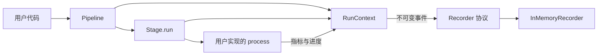

# expman 架构设计

日期：2026-09-08 · 目标版本：0.1.0

## 1. 目标与范围

expman 用可组合的阶段组织实验流程，让用户专注于每个阶段的数据处理逻辑，并提供一致的执行观测。

当前实现完成单次实验的最小闭环：定义阶段 → 组合 Pipeline → 执行 → 获得业务结果和观测事件。批量实验管理在此基础上逐步扩展。

核心设计遵循以下原则：

| 原则 | 具体落点 |
|---|---|
| 单一职责 | Stage 处理一个阶段；Pipeline 组织顺序；RunContext 提供运行服务；Recorder 接收事件 |
| 开闭原则 | 新增业务阶段继承 Stage；新增存储适配器实现 Recorder |
| 依赖倒置 | 执行层依赖 Recorder 协议，不依赖具体数据库或监控平台 |
| 组合与显式依赖 | Pipeline 组合阶段实例；业务对象通过输入输出传递；阶段配置通过构造函数注入 |
| 最小可用抽象 | 先稳定同步顺序执行与监测契约，再基于实际需求增加调度等能力 |

## 2. 组件关系



代码布局：

```text
src/expman/
    __init__.py     公共 API
    pipeline.py     阶段组合与顺序执行
    stage.py        业务扩展基类
    context.py      运行标识、执行作用域、计时与事件发送
    events.py       生命周期、指标和进度事件
    recorders.py    Recorder 协议与内存实现
examples/          可运行的接入示例
tests/             对外契约和失败行为测试
```

## 3. Stage：业务扩展点

```python
class Stage(Generic[InputT, OutputT], ABC):
    def __init__(self, *, name: str | None = None): ...
    def run(self, data: InputT, ctx: RunContext | None = None) -> OutputT: ...
    def process(self, data: InputT, ctx: RunContext) -> OutputT: ...
```

- 用户实现抽象方法 `process()`，接收输入并返回输出。
- `run()` 是基类提供的执行入口，通过 RunContext 统一包装生命周期监测。
- `run()` 使用 `typing.final` 标记，供静态工具检查覆盖行为；Python 运行时不会阻止子类覆盖，因此扩展契约要求用户只覆盖 `process()`。
- 名称默认使用子类名，可通过 `super().__init__(name="...")` 设置。自定义构造函数须调用基类构造函数。
- 阶段可持有模型、优化器、缓存等实例状态，也可在 `process()` 中组织自己的循环、验证与早停。
- Stage 可以独立执行，也可以放入 Pipeline。同一实例重复使用会保留状态；需要隔离的实验应构造独立实例。

计时实现集中在 RunContext，Stage 和 Pipeline 共用同一套生命周期语义。

## 4. Pipeline：组合与数据流

```python
pipeline = Pipeline([LoadData(), Train(), Evaluate()], name="experiment")
result = pipeline.run(data=None, ctx=context)
```

Pipeline 在构造时将阶段序列保存为 tuple，防止调用方后续修改原列表影响组合；阶段对象本身仍可持有可变状态。

执行规则：

1. 创建 Pipeline 执行作用域，记录开始事件。
2. 按声明顺序调用每个阶段的 `run()`。
3. 将每个阶段返回的对象直接传给下一个阶段。
4. 返回最后一个阶段的输出，记录成功事件。

空 Pipeline 原样返回输入；`None` 是合法输入和输出。任何阶段抛出异常，后续阶段停止执行，异常向调用方传播。

输入输出可使用列表、数组、数据类、模型对象或其他 Python 对象。推荐用数据类表达复杂阶段间契约，例如训练输出包含模型、验证数据和评估所需元信息。expman 不隐式复制、序列化或合并数据；原地修改输入的行为由业务阶段负责。

相邻阶段的数据类型兼容性由用户保证。Stage 泛型描述单个阶段的输入输出；当前异构 Pipeline 使用 `Any`，不会自动静态推导整条链，也不会在运行前验证数据 schema。

阶段可在自己的 `process()` 中调用另一个 Pipeline，并传入当前上下文；父子执行标识保留嵌套关系。当前执行为同步串行，Stage 实例与内存记录器按单线程使用设计。

## 5. RunContext：运行身份与公共服务

RunContext 保存 `run_id`、Recorder 和当前执行作用域，提供：

| 接口 | 用途 |
|---|---|
| `observe(name, kind=...)` | 创建子作用域并记录生命周期事件 |
| `report_metric(name, value, step=...)` | 上报有限实数指标 |
| `report_progress(completed, total=..., unit=...)` | 上报绝对完成量，可省略总量 |
| `emit(event)` | 将事件发送给记录器并隔离普通记录故障 |

业务依赖通过阶段输入输出和构造参数传递，RunContext 承载执行服务。

每次顶层调用省略 `ctx` 时自动创建独立 RunContext。需要检查记录或接入自己的存储时，由调用方显式创建并传入上下文。显式复用同一个上下文表示这些调用属于同一 `run_id`；每次具体执行仍获得不同的 `execution_id`。

上下文本身为 frozen dataclass。创建子作用域得到新的上下文对象，并共享 Recorder；父作用域不会被修改，嵌套执行结束后可以继续在原作用域上报事件。

## 6. 观测契约

### 6.1 生命周期

每次 Pipeline 或 Stage 执行产生一个开始事件和一个终止事件，使用相同 `execution_id`：

```text
running → succeeded | failed | cancelled
```

事件包含 run ID、执行 ID、父执行 ID、名称、执行种类和 UTC 时间戳。终止事件还包含耗时；失败事件记录异常类型和文本。

- 普通业务异常记为 `failed`，保留原异常继续抛出。
- `KeyboardInterrupt` 和 `SystemExit` 记为 `cancelled`，继续抛出。
- 子阶段失败或取消会使所在 Pipeline 以相应状态结束。
- 进程被强制杀死或机器断电时，进程内代码无法保证产生终止事件；未来持久化和执行管理层需要处理未结束记录。

Stage 名称允许重复。每次调用生成独立执行 ID，事件按调用顺序记录，支持同一实例在 Pipeline 中出现多次。

### 6.2 计时与进度

使用 `time.perf_counter()` 测量持续时间，UTC 时间戳用于展示和关联。某个执行自己的开始、结束记录器调用不计入其持续时间；执行内部的指标上报、子阶段监测等开销包含在内。Pipeline 总耗时包含阶段间编排，因此通常大于各阶段耗时之和。

自动计时观测主机端经过时间。GPU 异步任务如需测量设备完成时间，由业务阶段自行建立同步边界。

阶段内部进度由用户主动上报；`completed` 表示非负整数完成量，`total` 可未知，单位可以是 step、batch、epoch 或其他业务单位。已知总量时要求 `completed <= total`。事件记录器保存上报序列，不推断循环和进度重置语义。单个阶段有多个循环时，用户应定义清楚该阶段的统一进度口径。

### 6.3 记录器

`Recorder` 是具有 `record(event)` 方法的结构化协议。内置 `InMemoryRecorder` 保持事件的发送顺序。

记录同步发生在业务线程中，慢记录器会增加执行耗时。记录器的普通异常通过 logging 输出并被抑制，业务结果保持原有语义；因此记录属于尽力交付，记录器故障时可能缺失事件。若需要可靠持久化，应由适配器设计缓冲、重试和落盘机制。

内存记录器保留全部事件，适合小规模执行、示例和测试。长实验应控制上报频率，或接入持久化记录器。

## 7. 扩展顺序

以下为后续需求，具体 API 和实现将在对应迭代确定：

| 层次 | 候选能力 | 需要先明确的契约 |
|---|---|---|
| 单次运行管理 | 配置快照、日志、产物目录、结果持久化与查询 | 配置序列化、产物归属、存储 schema |
| 批量实验 | 配置维度展开、机器环境覆盖、本地验证与远端运行 | 单个 Run 描述、配置覆盖优先级、实验实例工厂 |
| 失败恢复 | 失败分类、重试、完成跳过、checkpoint 恢复 | 阶段幂等性、用户状态保存与恢复、外部副作用 |
| 数据复用 | 可选阶段缓存、跨 Run 共享产物 | 输入身份、相关配置、阶段版本、随机性与序列化 |
| 时间评估 | 根据阶段历史耗时和进度计算 ETA、批量可行性 | 总工作量、工作负载差异、预估质量评估 |
| 调度与资源 | 多进程、设备分配、显存观测、自适应并发 | 进程隔离、资源需求、OOM 分类、并发时的成本变化 |
| 展示与集成 | CLI 状态、对比报告、通知、远端后端 | 查询接口、事件订阅、外部系统适配 |

缓存应显式选择参与条件，键覆盖输入及相关配置、阶段版本和随机性。恢复训练需要用户提供模型、优化器、随机数及数据迭代位置等状态，不能由通用阶段计时自动推导。ETA 的精度需通过实际实验验证，随观测增加也可能修正此前估计。

扩展时优先增加独立服务或适配器，保持 Stage 的业务接口稳定。

## 8. 验证与演进

0.1.0 的行为测试覆盖顺序执行、对象传递、空管道、异常与取消、重复实例、运行隔离、嵌套作用域、指标与进度校验、记录器故障隔离和计时。

版本记录见 [CHANGELOG.md](CHANGELOG.md)，开发和 Git 约定见 [CONTRIBUTING.md](CONTRIBUTING.md)。
