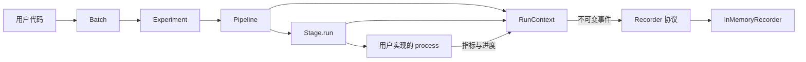

# expman 架构设计

日期：2026-09-08 · 目标版本：0.1.0

## 1. 目标与范围

expman 用可组合的阶段组织实验流程，让用户专注于每个阶段的数据处理逻辑，并提供一致的执行观测。

当前实现支持 YAML 配置展开与默认参数合并，以及 Pipeline 流程定义 → Batch 创建 Experiment → 顺序执行和队尾重试 → 获得业务结果和观测事件。

核心设计遵循以下原则：

| 原则 | 具体落点 |
|---|---|
| 单一职责 | Stage 处理一个阶段；Pipeline 定义顺序；Experiment 管理具体配置和尝试；Batch 管理执行队列；Recorder 接收事件 |
| 开闭原则 | 新增业务阶段继承 Stage；新增存储适配器实现 Recorder |
| 依赖倒置 | 执行层依赖 Recorder 协议，不依赖具体数据库或监控平台 |
| 组合与显式依赖 | Pipeline 组合阶段类型；业务对象通过输入输出传递；用户通过 ctx.cfg 读取完整实验配置 |
| 最小可用抽象 | 先稳定同步顺序执行与监测契约，再基于实际需求增加调度等能力 |

## 2. 组件关系



代码布局：

```text
src/expman/
    __init__.py     公共 API
    config.py       YAML 加载、候选组合展开与命名默认配置合并
    batch.py        实验集合、顺序队列和有界重试
    experiment.py   具体实验、隔离执行及尝试结果
    storage.py      原子快照、两份 checkpoint、保存器协议与运行锁
    frozen.py       配置的只读映射和序列
    pipeline.py     阶段组合与顺序执行
    stage.py        业务扩展基类
    context.py      运行标识、执行作用域、计时与事件发送
    events.py       生命周期、指标和进度事件
    recorders.py    Recorder 协议与内存实现
examples/          可运行的接入示例
tests/             对外契约和失败行为测试
```

## 3. Stage：业务扩展点

```python
class Stage(Generic[InputT, OutputT], ABC):
    def __init__(self, *, name: str | None = None): ...
    def run(self, data: InputT, ctx: RunContext | None = None) -> OutputT: ...
    def process(self, data: InputT, ctx: RunContext) -> OutputT: ...
```

- 用户实现抽象方法 `process()`，接收输入并返回输出。
- `run()` 是基类提供的执行入口，通过 RunContext 统一包装生命周期监测。
- `run()` 使用 `typing.final` 标记，供静态工具检查覆盖行为；Python 运行时不会阻止子类覆盖，因此扩展契约要求用户只覆盖 `process()`。
- 名称默认使用子类名，可通过 `super().__init__(name="...")` 设置。自定义构造函数须调用基类构造函数。
- 阶段可持有模型、优化器、缓存等实例状态，也可在 `process()` 中组织自己的循环、验证与早停。通过 `ctx.cfg` 读取完整实验配置。
- Pipeline 接收 Stage 类，并通过无参构造函数创建实例。模型等依赖当前配置的对象在 `process()` 内构建。
- Stage 实例也可直接调用 `run()`，这时实例状态由调用方管理。

计时实现集中在 RunContext，Stage 和 Pipeline 共用同一套生命周期语义。

## 4. Pipeline：组合与数据流

```python
pipeline = Pipeline([LoadData, Train, Evaluate], name="experiment")
result = pipeline.run(data=None, ctx=context)
```

Pipeline 在构造时将 Stage 类序列保存为 tuple，防止调用方后续修改原列表影响组合。它是可复用的流程定义，需要执行的阶段按顺序创建新实例。

执行规则：

1. 创建 Pipeline 执行作用域，记录开始事件。
2. 按位置检查已完成快照；可复用时恢复输出和 state 并跳过构造，否则无参构造 Stage 并调用 `run()`。
3. 将每个阶段返回的对象直接传给下一个阶段。
4. 返回最后一个阶段的输出，记录成功事件。

空 Pipeline 原样返回输入；`None` 是合法输入和输出。任何阶段抛出异常，后续阶段停止执行，异常向调用方传播。

输入输出可使用列表、数组、数据类、模型对象或其他 Python 对象。推荐用数据类表达复杂阶段间契约，例如训练输出包含模型、验证数据和评估所需元信息。expman 不隐式复制、序列化或合并数据；原地修改输入的行为由业务阶段负责。

相邻阶段的数据类型兼容性由用户保证。Stage 泛型描述单个阶段的输入输出；当前异构 Pipeline 使用 `Any`，不会自动静态推导整条链，也不会在运行前验证数据 schema。

阶段可在自己的 `process()` 中调用另一个 Pipeline，并传入当前上下文；父子执行标识保留嵌套关系。当前执行为同步串行，Experiment、Batch 和内存记录器按单线程使用设计。

## 5. RunContext：运行身份与公共服务

RunContext 保存 `run_id`、尝试编号 `attempt`、只读完整配置 `cfg`、可变 `state`、位置标识 `stage_id`、Recorder 和当前执行作用域，提供：

| 接口 | 用途 |
|---|---|
| `observe(name, kind=...)` | 创建子作用域并记录生命周期事件 |
| `report_metric(name, value, step=...)` | 上报有限实数指标 |
| `log_metrics(mapping, step=...)` | 将嵌套数值指标事务写入 SQLite |
| `report_progress(completed, total=..., unit=...)` | 上报绝对完成量，可省略总量 |
| `emit(event)` | 将事件发送给记录器并隔离普通记录故障 |
| `checkpoint.save(step=...)` | 同步保存当前阶段 state，保留最近两份 checkpoint |

业务数据通过阶段输入输出传递，RunContext 承载配置和执行服务。`ctx.cfg` 是当前尝试的完整配置，用户自行读取其中需要的字段。

每次顶层调用省略 `ctx` 时自动创建独立 RunContext。需要检查记录或接入自己的存储时，由调用方显式创建并传入上下文。显式复用同一个上下文表示这些调用属于同一 `run_id`；每次具体执行仍获得不同的 `execution_id`。

上下文本身为 frozen dataclass。配置递归包装为只读映射和序列，同一次尝试的阶段共享可变的 state；需要恢复的模型数据、循环位置等由用户放入 state。每次尝试先创建新的上下文，再从持久化快照恢复业务状态。运行时的尝试编号、执行 ID 和 Recorder 使用本次执行的信息。

## 6. 观测契约

### 6.1 生命周期

每次 Experiment 尝试、Pipeline 或 Stage 执行产生一个开始事件和一个终止事件，使用相同 `execution_id`：

```text
running → succeeded | failed | cancelled
```

事件包含 run ID、尝试编号、执行 ID、父执行 ID、名称、执行种类和 UTC 时间戳。终止事件还包含耗时；失败事件记录异常类型和文本。指标和进度事件也带有尝试编号。

- 普通业务异常记为 `failed`，保留原异常继续抛出。
- `KeyboardInterrupt`、`SystemExit` 等不属于 Exception 的 BaseException 记为 `cancelled`，继续抛出。
- 子阶段失败或取消会使所在 Pipeline 以相应状态结束。
- 进程被强制杀死时不能保证产生终止事件；恢复时依据持久化队列，将未结束尝试记为 cancelled，再从已成功写入的快照继续。

Stage 名称允许重复。每次调用生成独立执行 ID，事件按调用顺序记录，支持同一 Stage 类在 Pipeline 中出现多次，每次使用独立实例。

### 6.2 计时与进度

使用 `time.perf_counter()` 测量持续时间，UTC 时间戳用于展示和关联。某个执行自己的开始、结束记录器调用不计入其持续时间；执行内部的指标上报、子阶段监测等开销包含在内。Pipeline 总耗时包含阶段间编排，因此通常大于各阶段耗时之和。

自动计时观测主机端经过时间。GPU 异步任务如需测量设备完成时间，由业务阶段自行建立同步边界。

阶段内部进度由用户主动上报；`completed` 表示非负整数完成量，`total` 可未知，单位可以是 step、batch、epoch 或其他业务单位。已知总量时要求 `completed <= total`。事件记录器保存上报序列，不推断循环和进度重置语义。单个阶段有多个循环时，用户应定义清楚该阶段的统一进度口径。

### 6.3 记录器

`Recorder` 是具有 `record(event)` 方法的结构化协议。内置 `InMemoryRecorder` 保持事件的发送顺序。

记录同步发生在业务线程中，慢记录器会增加执行耗时。记录器的普通异常通过 logging 输出并被抑制，业务结果保持原有语义；因此记录属于尽力交付，记录器故障时可能缺失事件。若需要可靠持久化，应由适配器设计缓冲、重试和落盘机制。

内存记录器保留全部事件，适合小规模执行、示例和测试。长实验应控制上报频率，或接入持久化记录器。

## 7. YAML 配置与实验集合

公共接口：

```python
from expman import load_configs

configs = load_configs("experiment.yaml")  # list[dict[str, Any]]
```

一份实验 YAML 描述一个实验集合。每个展开后的配置字典对应一次 Run；无候选字段时集合大小为一。字段和层次由用户定义，加载器处理格式与展开规则，参数的业务含义由用户代码校验。

### 7.1 候选展开

`!choice` 必须标记非空序列，候选可以是标量、字典、列表或 `null`。普通列表始终保持列表结构，其内部显式标记的候选值可以展开。

```yaml
models:
  imputation: !choice
    - name: saits
      lr: !choice [0.001, 0.0001]
    - name: brits
```

此配置生成三次运行。递归展开时先处理候选内部的组合，再与所在层其他字段做笛卡尔积；未选择分支的参数不会进入当前 Run。顺序由 YAML 字段顺序和候选顺序决定，靠右的独立维度变化更快。重复候选保留为独立成员。

### 7.2 默认配置发现与合并

展开后，对每个包含 `name` 的映射节点，按字段路径查找文件：

```text
models.forecasting.name: patchtst
  → <项目根目录>/configs/models/forecasting/patchtst.yaml
```

模型参数直接与 `name` 并列。文件内容作为默认映射，与当前节点合并：两侧均为字典时递归合并；其余情况由实验配置的值整体替换，包括列表和显式 `null`。合并后继续处理子节点，包括默认参数引入的嵌套命名节点。

根节点的 `name` 对应 `configs/<name>.yaml`。列表元素使用其所在字段路径，列表索引仅用于错误位置展示，不作为目录名。`name` 值和用于查找的字段路径分量必须是非空字符串，不能包含路径分隔符或使用 `.`、`..`；解析后的路径须位于配置根目录内。循环默认文件引用会报错。

每次调用缓存已读取文件和缺失结果，避免随 Run 数重复读取或重复警告。缓存仅在本次调用内有效，返回结果不共享可变数据，也不修改文件。

### 7.3 文件契约与错误

- 使用 PyYAML SafeLoader 的独立子类识别 `!choice`，不修改全局 YAML 加载行为。
- 实验文件和默认文件都要求单个 YAML 文档、映射顶层、字符串键；重复字段和未知标签报错。
- 默认文件中任何位置的 `!choice` 都报错，即使对应参数会被实验配置覆盖。
- 普通非循环 YAML 锚点可用；循环引用及 YAML 合并键 `<<` 报错。
- 缺失实验文件、已有文件解析失败、读取失败等抛出 `ConfigError`，包含来源路径；解析错误还携带 YAML 位置信息。
- 缺失默认文件发出 `MissingConfigWarning` 并继续，同一次加载对同一路径只警告一次；调用方可使用 Python warnings 机制控制展示或提升为错误。

`load_configs()` 一次性返回整个列表。加载失败时不返回部分结果；该接口负责解析配置，运行身份分配和执行队列由 Batch 与 Experiment 处理。

## 8. Experiment 与 Batch

```python
pipeline = Pipeline([Impute, Forecast, Evaluate])
batch = Batch(pipeline, cfg="experiment.yaml", max_retries=1)
results = batch.run()
```

### 8.1 实验身份与隔离

Experiment 保存一份具体配置、稳定的 `run_id` 和独立目录。首次执行从 `None` 输入开始；每次尝试使用新的上下文，复用已完成阶段的快照，并自动恢复待执行阶段最新可用的 checkpoint。只实例化仍需执行的阶段。

阶段收到完整的 `ctx.cfg`，尝试编号 `ctx.attempt` 从 1 开始递增。`experiment.cfg` 返回配置副本，调用方不能通过该属性修改实验的初始配置。用户的类变量、模块全局变量、外部服务和文件不在实例隔离范围内。

### 8.2 顺序队列与重试

Batch 构造时加载 YAML，并按展开顺序创建 Experiment；也接受一份已解析的配置字典作为单成员集合。配置加载错误在执行前抛出。

GPU 派发以顶层 Stage 为单位，重试候选优先，新的参数组合按同 Stage 历史的配置距离排序；联合装箱还要满足主机内存和显存合约。成功则完成；普通失败在重试预算未耗尽时重新入队。默认 `max_retries=1` 表示最多两次尝试；该参数必须为非负整数。

Stage 构造异常采用同一重试策略，单个实验失败不终止整组。

重试保留实验 ID、递增尝试编号，恢复已保存进度。业务阶段需要自行管理重复执行带来的文件或外部系统副作用。失败后仅保存错误类型和文本，不保存异常对象或 traceback；Batch 在失败后执行垃圾回收以释放不可达的用户对象。

中断信号记录取消状态后继续抛出，立即停止队列；该实验保留在队首供恢复。中断后可通过 `batch.results` 查看部分结果。使用 `Batch.resume(pipeline, output_dir)` 从持久化队列恢复，中断次数不计入失败重试预算。每个 Batch 对象只执行一次。

### 8.3 结果与观测

`Batch.run()` 返回按配置顺序排列的 `tuple[ExperimentResult, ...]`，不受实际重试顺序影响。每个结果包含稳定 `run_id` 和全部 `AttemptResult`。

AttemptResult 记录尝试编号、状态、耗时、输出及错误摘要。ExperimentResult 的状态和输出取最后一次尝试，耗时为全部尝试耗时之和；尚未执行时状态为 `pending`、输出为 `None`。结果是尝试历史的快照。输出不随结果常驻内存：AttemptResult 只保留摘要和最终阶段 SnapshotOutput，`output` 每次按阶段快照读取。因此父进程内存不随已完成实验数增长，中断后 `batch.results` 仍能读到全部输出，代价是每次访问都产生一个新的副本，修改不回写记录，重复使用需要调用方自行保存引用。

Batch 默认使用一个内存 Recorder 收集所有实验事件，可传入自定义记录器。事件层次为 Experiment 尝试 → Pipeline → Stage，通过 `run_id`、`attempt` 和父子执行 ID 关联。记录器普通故障继续采用尽力交付语义，不将一次成功业务执行转为重试。

## 9. 持久化与恢复契约

默认以 `runs/<batch-id>/` 作为 Batch 目录。用户可指定新的 `output_dir`；已有目录通过 resume 打开，创建操作不会覆盖历史数据。

```text
<batch>/
    batch.pkl                      配置清单、Pipeline 签名、队列、活动实验、尝试摘要
    run.lock                       进程级互斥锁
    experiments/<run-id>/
        config.pkl                 最终配置，只保存一次
        rng_initial.pkl            run 初始化后的随机状态
        stages/
            pipeline.pkl           当前流程签名
            0/
                status.pkl         框架维护的阶段状态
                completed.pkl      返回值 + state + 随机状态的完整快照
                checkpoints/
                    000...001.pkl  state + 进度 + 内部调用位置
                    000...002.pkl
```

Stage ID 直接取局部位置 `0、1、2…`，名称只用于展示。嵌套流程使用父阶段位置、调用序号和子阶段位置形成数字路径；checkpoint 同步保存内部调用计数，避免恢复循环中的嵌套 Pipeline 时混用结果。

阶段完成快照是返回值和 state 的单个保存事务。写入临时文件、flush/fsync 后原子替换目标路径，成功后才算完成。保存失败按普通阶段失败处理；未完成的临时文件不参与恢复。状态文件自动记录 running、succeeded、failed 或 cancelled，恢复复用时记录 reused 标记，执行事件也带有该标记和 stage_id。

Checkpoint 通过 `ctx.checkpoint.save(step=...)` 同步保存当前 state，保留最近两份成功写入记录。进入 process 前先恢复阶段入口的输出/state，再用最新可读取 checkpoint 的 state 覆盖；最新损坏时 warning 并尝试上一份，两份都不可用则使用入口状态。已完成阶段快照损坏会报 StorageError，避免静默传递错误的阶段输入。

Batch 清单原子记录待执行队列、当前活动成员及尝试摘要。Ctrl+C 会将当前成员放回队首并保存取消记录；进程突然结束时，resume 根据活动成员补记中断尝试，其未知耗时记为 0。已完成成员保持完成，失败预算依据已持久化的 failed 尝试数计算。快照和清单不能构成跨文件的单次事务；若进程在结果保存后、清单更新前结束，恢复会复用已保存阶段结果补完该实验。

恢复读取保存的配置而非原 YAML，并校验阶段类、顺序及可获取的源码摘要；默认模块和类标识不等同于完整依赖环境指纹。实例已加载后如果清单被另一执行者更新，会拒绝使用陈旧队列。运行期间持有操作系统锁，进程退出后锁自动释放。

默认 PickleSerializer 保存可 pickle 的 Python 对象，加载只适用于可信文件和兼容的依赖、设备环境。Serializer 协议允许替换 dump/load，创建与恢复时须使用匹配的实现。用户负责填充和应用 model/optimizer state_dict、独立随机生成器和数据位置等业务状态；框架不会自动捕获活跃模型的内部执行状态。配置中的字典、列表、集合转换为只读包装，任意可变业务对象应放进 state。

这里的状态快照与清单用于恢复，Recorder 事件仍由用户选择存储适配器；默认内存 Recorder 不提供跨进程指标历史。

## 10. 扩展顺序

以下为后续需求，具体 API 和实现将在对应迭代确定：

| 层次 | 候选能力 | 需要先明确的契约 |
|---|---|---|
| 运行查询 | 指标历史、日志、产物检索与对比报告 | 查询与事件存储 schema |
| 批量运行环境 | 机器环境覆盖、本地验证与远端运行 | 运行环境及进程边界 |
| 恢复扩展 | 保存器集成、异步保存及跨环境迁移 | 数据一致性、依赖环境及外部副作用 |
| 数据复用扩展 | 跨 Batch 共享产物 | 外部输入版本与缓存清理策略 |
| 时间估计扩展 | 并发环境校正、跨 Batch 校准与预算判断 | 环境可比性、资源竞争观测和实际覆盖率 |
| 调度与资源扩展 | 真实 GPU 工作负载校准、设备迁移策略 | 资源竞争和不同设备上的恢复兼容性 |
| 展示与集成 | CLI 状态、对比报告、通知、远端后端 | 查询接口、事件订阅、外部系统适配 |

缓存匹配需要覆盖输入及相关配置、阶段版本和随机性。恢复训练需要用户提供模型、优化器、独立随机生成器及数据迭代位置等状态，不能由通用阶段计时自动推导。ETA 的精度需通过实际实验验证，随观测增加也可能修正此前估计。

扩展时优先增加独立服务或适配器，保持 Stage 的业务接口稳定。

## 11. 验证与演进

0.1.0 的行为测试覆盖顺序执行、对象传递、空管道、异常与取消、重复实例、运行隔离、嵌套作用域、指标与进度校验、记录器故障隔离和计时。

配置测试覆盖候选组合、分支独立性、普通列表、模型切换、默认合并、文件路径解析、缺失警告、错误输入和 Run 数据隔离。

批量与恢复测试覆盖队尾顺序、尝试预算、阶段复用、只读配置、state 恢复、两份 checkpoint、损坏回退、保存失败、进程锁、Pipeline 匹配，以及独立子进程的 SIGINT 和突然退出恢复。

版本记录见 [CHANGELOG.md](CHANGELOG.md)，开发和 Git 约定见 [CONTRIBUTING.md](CONTRIBUTING.md)。

## 数值指标持久化

`RunContext.log_metrics(mapping, step=None)` 在受管阶段中提供同步持久化接口。`metrics.py` 负责整树校验、路径编码和 SQLite 事务写入；Experiment 注入存储服务，Batch 在创建及恢复时为全部实验指定同一个 `metrics.sqlite3`。连接按调用关闭，不进入 checkpoint 或阶段快照。

`metrics` 表字段为 `run_id`、`stage_path`、`step`、`metric_path`、`value`、`attempt`、`updated_at`。前四项构成主键；位置路径与指标路径使用 JSON 数组文本，汇总 step 使用非空哨兵值 `-1`。指标值保存为 REAL，更新时间为 UTC ISO 8601。UPSERT 只更新传入的叶子指标，恢复不删除历史行。执行次数是最近一次写入的元数据，不参与唯一键。

所有叶子先验证为有限实数，再开始同一次调用的事务。数据库写入错误包装为 `StorageError` 并传播给阶段，触发已有失败及队尾重试机制。SQLite 指标事务与阶段快照、队列清单分别提交；快照失败后已提交指标保留，重试以相同唯一键覆盖。可选 Recorder 的错误隔离策略继续只适用于观测事件。

## 批次时间估计与调度

`Batch.estimate(coverage=None) -> TimeEstimate` 根据尚未物化的顶层 Stage 组估计 GPU Batch 的剩余完工时间。每个 Stage 使用同组近邻配置的经验分位数耗时；运行中的 Stage 扣除已运行时间，再把待执行工作装入当前各卡并发槽位。没有成功耗时样本或无可用槽位时返回未知；所有工作完成时返回零。覆盖参数保留在 Batch 清单中，默认 0.8。

候选选择优先处理重试，然后按同 Stage 已采样配置的距离覆盖异质参数。联合装箱以主机内存和各卡显存的剩余资源为主要评分，参数距离只打破资源效果接近的平局。后台线程刷新 ETA 并保存累计墙钟时间。

## 多卡进程调度

YAML 顶层 `device` 是 Batch 级必填的非空、非负且不重复的 NVIDIA GPU 编号列表，所有展开成员一致；不接受 `!choice`。GPU 分配不改写只读 `ctx.cfg`；子进程启动前用 GPU UUID 设置 `CUDA_VISIBLE_DEVICES`，同一实验只使用一张卡。

`GpuScheduler` 在主进程持有 Batch 锁并管理多个独立解释器；单个实验的每次尝试使用新的进程组。bootstrap 先安装父进程 EOF 监听，再导入用户模块和反序列化 Pipeline/Serializer。入口脚本的顶层 Stage 可复用，主入口必须有 main guard；局部类和闭包不满足默认进程传输契约。工作进程持有实验目录锁，避免同一实验快照被两个执行者写入。

调度任务是一个顶层 Stage。调度器只派发尚未完成的目标 Stage；子进程在进入目标前恢复已有前缀快照，禁止隐式执行缺失的上游 Stage。完成消息携带 StageResult（状态、耗时）、该进程最终的 cgroup 内存当前值/峰值、PyTorch 分配器显存当前值/峰值和配置依赖；普通 Recorder 事件也通过同一私有 socket IPC 传输。调度器每个 tick 读取全局主机与整卡显存，并消费 IPC，但不逐个查询 worker 的 `/proc` 或 cgroup；仅在 worker 已退出而 IPC 来不及报告 cgroup OOM 时读取一次该 cgroup 的事件计数。

每个顶层 Stage 使用独立的耗时、主机峰值和显存峰值模型。特征为滚动累积配置读取路径：所有上游 Stage 的依赖与当前 Stage 已观测依赖共同组成输入身份；此前缀相同即上游输入相同。无样本时以完整配置选择异质冷启动组合；有样本时从资源可行候选中选择与同 Stage 样本距离最大的配置。估计取同 Stage 最近配置的保守经验分位数，样本不足时取整个 Stage 的分位数；因此不会因稀疏高维数据向未采样区域产生无界外推。模型缓存只在新的 Stage 完成时失效，tick 的瞬时资源报告不会训练模型。

未知 Stage 的主机和显存峰值各为 1 GiB。主机准入要求 `MemAvailable - HOST_RESERVE_KB` 足以覆盖新 Stage 的 cgroup 合约和所有运行 worker 尚未使用的合约部分；每个 cgroup `memory.max` 是模型峰值的 110%。拒绝申请或接近上限时，样本只按固定倍率作为有限的下界并抬升同一组合的重试估计。GPU 准入按整卡空闲显存及同卡 PyTorch 尚未使用的分配器合约计算；PyTorch 可用时以 `set_per_process_memory_fraction` 应用该合约，合约不会超过物理卡容量。没有 PyTorch 遥测并不被当作 CPU 证据；显式报告零峰值的 Stage 不预留显存但仍分配一张可见 GPU。

没有显存比例门槛或 CUDA OOM 的整卡 gate。CUDA OOM 无论来自 expman 自己的 PyTorch 分配器合约还是外部竞争，都代表该 Stage 超过本次显存合约；历史以本次合约为有限下界，下一次采用提高后的合约重试而不消耗用户失败次数。每 tick 使用整卡空闲显存及运行 worker 尚未使用的合约部分重新做联合装箱，因此扩大后的合约只有在资源确实可用时才派发。主机读数紧张/失败仍使用全局 HostGate 减载最新 worker。GPU UUID 变化或设备缺失属于不可恢复的一致性错误。

主进程在创建 worker 前原子保存活动 Stage、Stage 尝试编号与队列状态；Stage 快照/checkpoint 和 SQLite 指标仍由子进程写入。完成 IPC 驱动主进程更新 Stage 历史、最终 ExperimentResult、设备/并发历史和队列。硬退出时父进程 EOF 监听清理进程组；resume 对活动 Stage 补记中断并从相应 Stage 重试。真实 NVIDIA 验证仍应在可访问 GPU 的 uv 环境执行。


## 随机数生命周期

根部 `seed` 是 run 级必填框架参数，只接受 uint32 范围整数。Batch 在创建目录前验证每份配置，Experiment 也独立验证。`RandomStateManager` 在尝试开始时加载 Python、NumPy/PyTorch；首次执行设种子并原子保存 rng_initial.pkl，之后的尝试读取该记录。依赖损坏等导入错误继续传播。GPU 子进程已在导入这些库前绑定可见设备。

RunStore 的运行期 rng 服务负责为完成快照/checkpoint 加入独立 rng_state 字段。状态包含格式版本、有效 seed、Python 状态、NumPy 全局状态（普通标量/列表）、PyTorch CPU/CUDA 状态（bytes 列表）；不放进 ctx.state，不将库模块或运行期管理器序列化。公开 seed_everything() 提供相同的初始化行为。

Pipeline 复用已完成阶段时恢复其结束随机状态；选择 checkpoint 时先校验并恢复随机状态，构造 Stage 后再次恢复 checkpoint 状态，避免构造消耗推进业务随机序列。无有效 checkpoint 时通过初始状态与上游完成快照重建阶段入口。状态恢复先校验 Python/NumPy/CPU 生成器及 CUDA 数量，应用失败时回滚到应用前随机状态，使候选 checkpoint 回退不会残留部分恢复结果。随机状态保存故障与对应业务快照保存故障同样视为阶段失败。

旧记录缺少 rng_state 时 warning 后保留业务恢复兼容性，不承诺随机连续。新的初始记录和已完成记录随机状态损坏不静默重置种子。随机库/可见 CUDA 设备需兼容；独立生成器、子数据加载进程、process 内部的模型重建逻辑和确定性算法选择仍由业务代码负责。当前实现为单个 run 的随机状态初始化与恢复，跨实验前缀共享另行实现。

## 同 Batch 连续前缀缓存

Batch 为各 Experiment 和 GPU worker 提供同一个 cache 根目录。Pipeline 在阶段入口先检查本 run 完成记录，再查询共享节点；第一次未命中后关闭后续共享查询。已执行节点的本地引用记录 shared_reused=False，重试时沿用该边界。已有阶段状态或 checkpoint 表示本 run 已进入阶段，优先恢复自己的进度。

ConfigurationReads 记录阶段执行及序列化期间对只读配置的访问路径，并对路径的完整值计算摘要。父容器读取覆盖完整子树，遍历覆盖当前节点；缺失索引也记录，防止用户捕获 KeyError 后遗漏依赖。禁止配置 get 和成员存在性查询。嵌套 Pipeline 共用外层追踪周期。checkpoint 在内存中通过配置的 Serializer 将状态序列化为字节，再导出读取依赖，将字节载荷与依赖封装到同一原子文件。这样能保留序列化期间的读取，并且用户对象只序列化一次。恢复时解码载荷、校验依赖格式及配置值，再将路径合并到当前追踪器；阶段结束时导出累计读取集合。旧 checkpoint 缺少依赖记录时保守标记根配置依赖。封装暂存序列化字节会增加保存时的内存占用。

PrefixCache 使用 Pipeline 签名与根 seed 隔离树；树边包含阶段位置、配置依赖与不可变 UUID 节点。snapshot.pkl 原子写入完成后才发布 metadata.pkl，读者只扫描已发布元数据。节点保存输出、state、随机状态及数值指标。本地完成记录引用节点，恢复时重新反序列化以隔离可变对象。候选损坏时 warning 并重新计算；本 run 已提交引用损坏则按恢复错误处理。

共享命中将指标复制到当前 run，再提交本地完成引用。指标 UPSERT 允许中途退出后重放。旧格式本地快照仍能恢复，但缺少共享父节点身份的后续阶段只保存本地快照。并发发布使用独立节点，允许重复计算，不等待其他生产者。

## 可恢复的阶段诊断计时

每个阶段的完成快照及 checkpoint 都包含 `elapsed_seconds`（秒）。阶段恢复 state 和随机状态之后、构造 Stage 之前启动单调时钟；保存时将恢复的累计值与本次执行时长相加，与进度写入同一原子记录。计时字段由框架管理，不占用 ctx.state。

例如 checkpoint 记录 100 秒，随后运行 20 秒后中断；恢复后再运行 30 秒完成，阶段快照记录 130 秒。没有 checkpoint 的失败阶段重跑时从零计时。停机时间和恢复检查点的加载时间不计入累计值。保存时取写入前的时间截点，因此当前保存操作的耗时不在该记录内；不中断继续运行时，它会进入下一次记录的执行时长。嵌套阶段独立计时，外层耗时包含内层执行，不能直接将各层耗时相加。

共享复用保留源快照的 elapsed_seconds，本 run 的 status.pkl 另存 restore_seconds，覆盖查找、加载及恢复操作（截至写入状态之前）。正常完成的 status.pkl 同步记录阶段累计耗时。旧快照缺少计时字段时视为未知，续跑后的累计值保持 None，避免把部分时长当作完整历史。损坏的 checkpoint 计时字段触发与 state 相同的回退流程。

Batch 的尝试耗时与剩余时间估计保持原有规则，仍计入真实的失败、中断执行消耗。阶段计时用于实验诊断。

命名默认配置统一位于项目根目录的 `configs/`。项目定位按实验 YAML 的祖先目录、当前工作目录的祖先目录依次查找，取首个包含 `pyproject.toml` 文件或 `.git` 标识的目录。Git worktree 的 `.git` 文件同样有效。找不到项目标识时，命名配置加载抛出 ConfigError；没有 name 的纯配置无需定位项目。

GPU 显存查询使用内部默认超时 3 秒。实测该查询在 WSL2 单卡机器上按调度节奏运行 300 次：中位 53 毫秒、p99 300 毫秒、最坏 620 毫秒；宿主机 CPU 满载时中位 143 毫秒、最坏 915 毫秒。超时取观测最坏值的约三倍，既避免误判为内存不足（会误杀运行中的尝试），又把驱动卡死时的单个 tick 限制在 3 秒。`nvidia-smi` 先从 PATH 解析，失败时回退到 WSL2 的 `/usr/lib/wsl/lib/nvidia-smi`，因为 WSL2 默认不把该目录加入 PATH。主机内存读数与显存查询在同一个调度 tick 内完成，任一路径失败、超时或返回无效数据都按主机内存不足处理：清除旧读数、发出 RuntimeWarning、置 `mem_block` 并减载一次，下一个 tick 重新查询，调度不因查询失败终止。`/proc/meminfo` 缺失、字段不全或数值超范围都会进入该路径，不使用可能造成误减载的近似值。GPU 身份改变属于不可恢复的设备一致性错误。上述参数由框架内部定义。

Batch 的累计墙钟时间与最近有效剩余时间区间原子保存在 `timing.pkl`。运行期间约每 5 秒更新一次，正常结束或捕获中断时再保存；关闭 CLI 仍记录。`Batch.elapsed_seconds` 返回跨 resume 累计运行时间，排除两次运行之间的停机时间，并行实验不重复累计。突然退出只能恢复最近成功保存的累计值。GPU 恢复初期尚无可用调度数据时，直接显示保存的同覆盖率预测区间，取得有效数据后更新。旧目录缺少 timing.pkl 时无法还原历史墙钟时间，从零开始累计；原有实验耗时及并发历史仍用于重新估计。

GPU 派发按 Stage 的异质配置距离生成候选，再联合主机内存和各卡显存选择装箱计划。CLI 读取最近有效 ETA，后台计时线程刷新默认覆盖率的预测并保存；显式调用 `Batch.estimate()` 即时计算。
